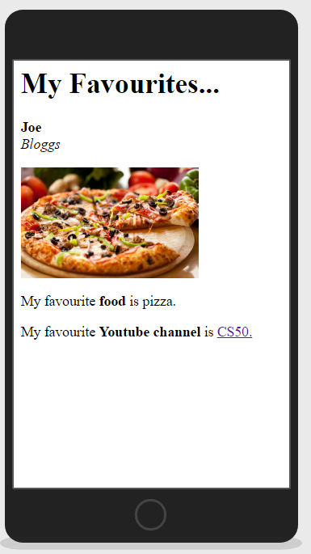

# Y8 Coding Project 4: Recreate This Web Page

## Setup

Install the **Live Preview** extension

Write all of your code for this task into the `index.html` file.

## Intro

Your task is to recreate the web page shown above, as closely as possible.

You will need to use the correct HTML <tags> to:

- Display a heading
- Make text bold
- Make text italic
- Insert an image
- Add a hyperlink

## Extension Tasks:

Research and write the code to implement the following:

- Change the colour of the background of each page.
- Change the colour of the word ‘food’.
- Use Google Fonts to change the font of the main heading.
- Create a _rollover image_ that changes when the user hovers over your food.
- Choose three of your friends to each create a ‘My Favourites’ page for. At the top of every page display a menu that allows the user to navigate between the different pages.
